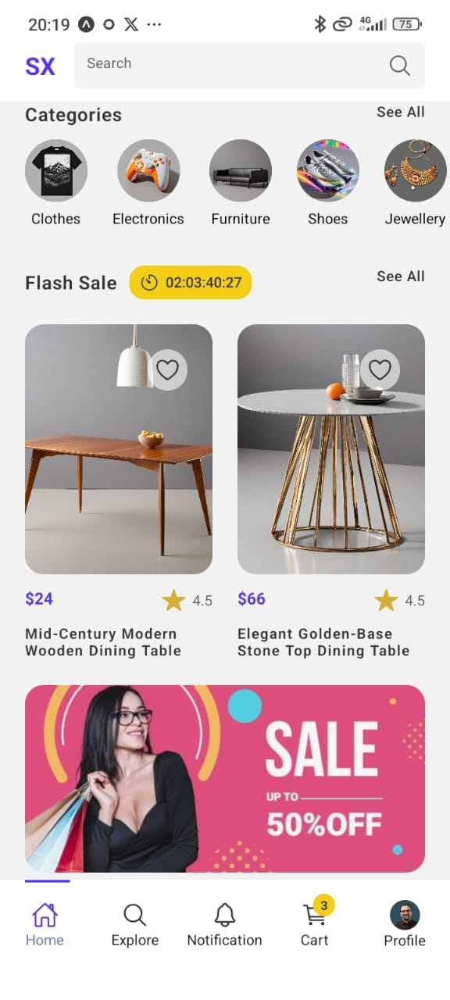

# React Native E-Commerce

The E-Commerce React Native App is a fully functional, cross-platform mobile application designed to provide a seamless shopping experience for users. The app leverages React Native's powerful framework to deliver a smooth and responsive user interface, combined with efficient backend integrations to handle product browsing, order management, and secure transactions.

Additional features:

- [Expo Router](https://docs.expo.dev/routing/introduction/) file-based navigation and API Routes
- [Expo Svg](https://docs.expo.dev/versions/latest/sdk/svg/) A library that allows using SVGs in your app

## Screenshots

